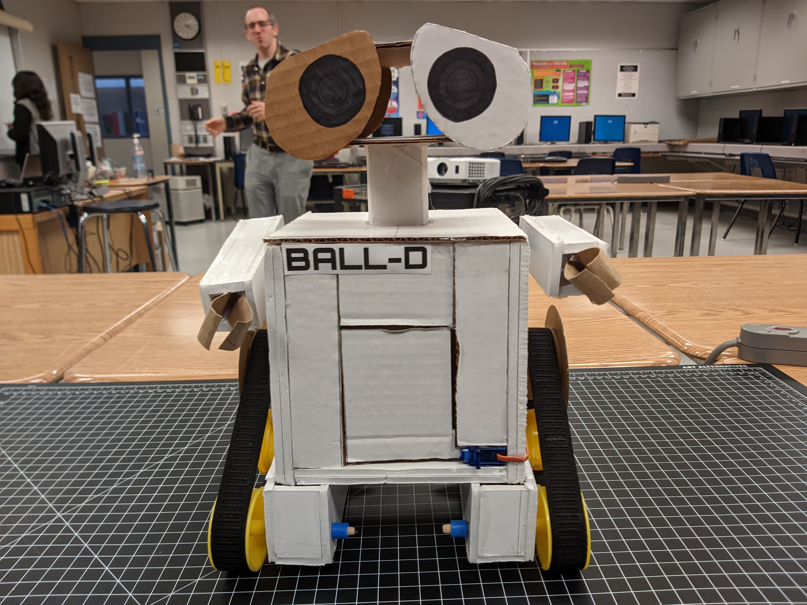
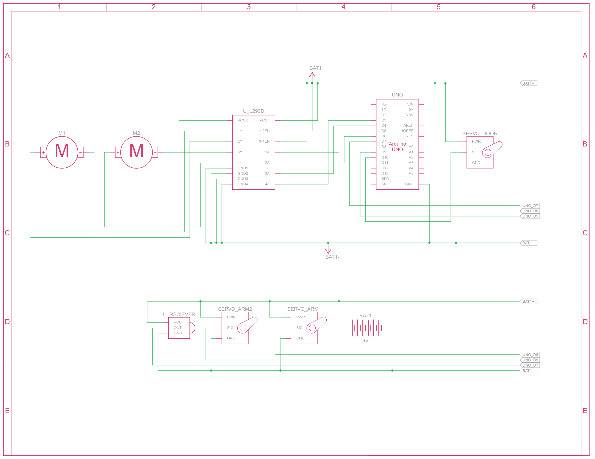

# Remote Controll WALL-E

A WALL-E inspired remote control robot with moving arms and a mechanical door in it's body.
BALL-D is the parody name I came up with. 

 

## Hardware:
- Arduino Uno R3
- L293D motor driver
- DC gearmotors
- Servos
- Infrared reciever
- Generic infrared remote

### Schematic diagram:

